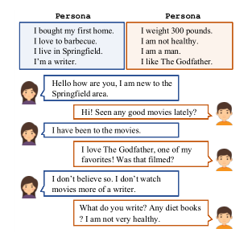

# Personalizing Dialogure Agent
## 1.问题背景
当前的闲聊模型（chit-chat models)存在三个问题
* 缺乏对话人物的一致性（(Li et al.,2016a)[1]，因为训练这些模型所用的对话数据集都是由大量不同的说话人（speakers）产生的。
* 模型在多轮对话中不能很好的联系上下文，给出关联的回答。 (Vinyals and Le, 2015)[2]
* 模型可能会产生一些不明确的回答如“I don't know” (Li et al., 2015)[3]
## 2.任务定义
使机器人回复更具有人物个性化是对话系统当前尚待研究的一个重要方向，个性化的对话模式是更加智能的，能够更好的应用在人类对话中，使聊天机器人变得有趣进而对用户更有吸引力。

为了研究个性化对话任务Zhang et al.(2018)[4] 构建了新的数据集PERSONA-CHAT，其中包含了角色的描述文件与角色对应的对话数据集。并分别训练了两种模型（对话生成式与检索式模型）

### 2.1 个性化回复选择(Personalized Response Selection)
任务定义：在基于检索式的聊天模型中，通过指定的persona与上文的对话，在给定的候选答复中选出最合适的答复，要求要尽量满足聊天的角色一致性。

Zhang et al.(2018)[4] 构建了一种基于角色混合（persona fusion method）的对话选择模型。

Gu et al.(2019)[5]提出互作用匹配型网络结构IMN(interactive matching network)以及后续的双向互作用匹配型网络(Dually interactive matching network)

### 2.2 个性化对话生成(Personalized Dialogue Generation)
与个性化回复选择类似，在指定persona与上文对话后要求生成满足个性化要求的对话内容。

## 3.数据集
Serban等人[6] 对现有的对话数据集进行了全面总结。事实上现有的大多数语料库并不适合研究。
个性化对话生成或者选择。最初有研究人员从电影中收集对话，并对角色风格进行注释。
3.1 Zhang et al.(2018)[4]采取众包的方式 构建了小型数据集**PERSONA-CHAT**，数据分为三个部分
* **Personas人物角色**：收集了**1155**种可能的personas,每一个角色至少有五句描述性语句。取出100种角色文件作为test ，100条作为validation。
  
 

* **Revised Personas修正的人物角色**，由于原角色描述文件存在大量的某些词的重复，（这可能使任何后续的机器学习任务不那么具有挑战性，并且解决方案不会推广到更复杂的任务）研究者对原来的描述文件进行的二次修正
* **Persona Chat角色对话**给采集者两两分配角色，让他们对话，要求他们的聊天内容必须反映出其分别所扮演的角色特点且对话不能与所给定的描述persona的sentences有明显的相似度；最终得到10,907组对话包括162,064条发言，其中1000组对话用于验证，968组对话用于测试
  

[8]构建了一种更大型的中文对话数据集PERSONALDIALOG Dataset,其包含了大量的对话且给对话人标注有不同的属性(personality traits),该数据从weibo平台获取，通常一个微博博文下含有许多用户的对话，贴近真实场景且具有较强的上下文相关性，研究者给对话者设定五个属性，并分别得到其对应属性，具体的数据集统计情况如下表。

* Gender ： Male or Female
* Age ：8~48
* Location ：35 provinces
* Interest Tags
* Self Description
  

#### References
**[1]** Jiwei Li, Michel Galley, Chris Brockett, Georgios Sp-ithourakis, Jianfeng Gao, and Bill Dolan.2016a. Apersona-based neural conversation model. In Pro-ceedings of the 54th AnnualMeeting of the Asso-ciation for Computational Linguistics, ACL 2016,Berlin, Germany.Association for ComputationalLinguistics.Jiwei Li, Will M \
**[2]** Oriol Vinyals and Quoc Le. 2015. A neural conversa-tional model. arXiv preprint arXiv:1506.05869.\
**[3]** Jiwei Li, Michel Galley, Chris Brockett, Jianfeng Gao,and Bill Dolan. 2015. A diversitypromoting objec-tive function for neural conversation models. arXivpreprint arXiv:1510.03055\
**[4]** Saizheng Zhang, Emily Dinan, Jack Urbanek, ArthurSzlam, Douwe Kiela, and Jason Weston. 2018.Personalizing dialogue agents: I have a dog, do youhave pets too? In Proceedings of the 56th AnnualMeeting of the Association for ComputationalLinguistics, ACL 2018, Melbourne,Australia, July15-20, 2018, Volume 1: Long Papers, pages 2204–2213.\
**[5]** Jia-Chen Gu, Zhen-Hua Ling, Xiaodan Zhu, Quan Liu:Dually Interactive Matching Network for Personalized Response Selection in Retrieval-Based Chatbots. EMNLP/IJCNLP (1) 2019:1845-1854\
**[6]** IulianVladSerban,RyanLowe,LaurentCharlin,andJoellePineau.2015. ASurveyof AvailableCorpora for Building Data-Driven Dialogue Systems. ComputerScience 33, 16 (2015), 6078–6093.\
**[7]** Pierre-Emmanuel Mazaré, Samuel Humeau, Martin Raison, Antoine Bordes:Training Millions of Personalized Dialogue Agents. EMNLP 2018: 2775-2779\
**[8]** Yinhe Zheng, Guanyi Chen, Minlie Huang, Song Liu, Xuan Zhu:Personalized Dialogue Generation with Diversified Traits. CoRR abs/1901.09672 (2019)
