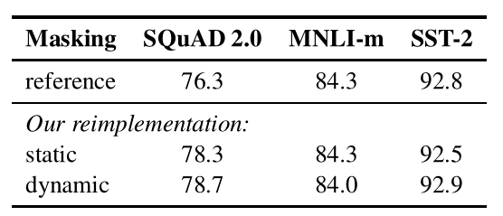
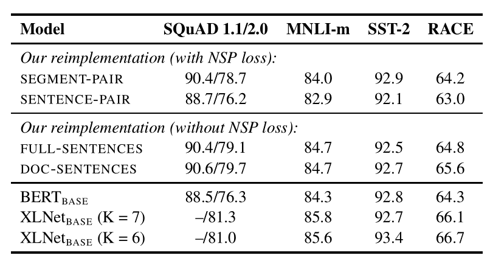
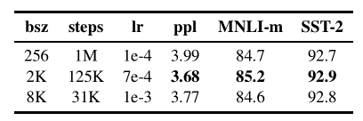
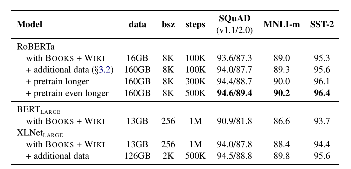
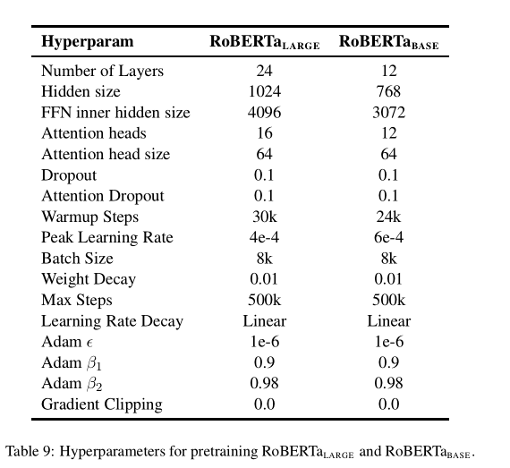

# Notes for RoBERTa
RoBERTa对于原BERT主要有以下四点改进
* 动态mask方法
* 使用FULL-Sentences 去除NSP
* 在更大的数据集上增大batch size与epoch
* 使用byte pair encoding
## 1.Larger Dataset
RoBERTa中使用以下5个语料集组成约超过160G的训练数据、
* BOOK CORPUS (Zhu et al., 2015)以及English WIKIPEDIA BERT. (16GB)
* CC-N EWS , which we collected from the En-glish portion of the CommonCrawl News dataset (Nagel, 2016). The data contains 63
million English news articles crawled between September 2016 and February 2019. (76GB after filtering). 
* OPEN WEB TEXT (Gokaslan and Cohen, 2019),an open-source recreation of the WebText corpus described in Radford et al. (2019). The text is web content extracted from URLs shared on Reddit with at least three upvotes. (38GB).
• STORIES , a dataset introduced in Trinh and Le (2018) containing a subset of CommonCrawl data filtered to match the story-like style of Winograd schemas. (31GB).
## 2.Dynamic Masking
原始的bert中在数据处理阶段对某一input生成10种静态固定的mask，分别参与40个epoch,平均每个mask训练10次(即十次重复训练)，在RoBERTa中使用dynamic mask方法即每次输入到模型中训练时随机进行mask,对比效果结果显示动态方法的效果更好，推测应该是在大数据集上随机mask使模型具有更好的泛化与表示能力\

## 3.Model Input Format and Next Sentence Prediction
论文中给出四种方案分别是
* segment-pair + nsp
  输入中包含多组语句，每组语句有两句话，使用NSP计算其是否具有上下文关系的损失（原bert）总token不大于512
* sentence-pair + nsp
* 输入中只有一组句子，一组句子中两句话，同样计算NSP loss 总token不大于512,由于一组句子总token较少，通过增加batch_size式token总数与其他方法相同
* full-sentences 输入连续的多个句子，其可以跨越多个文章，在文章分格处加入对应分隔符，不使用NSP loss
* doc-sentences 输入连续多个句子但其必须在同一文章中，缺少的token通过增加batch_size扩充。
实验结果：

分析结果可以解释segment-pair相比sentence-pair更好的捕获到上下文语句之间的联系；而doc-sentences 比full-sentences 具有更好的文章语义完整性与统一性，不同的文章语料其关联性不高，full-sentences可能是因为跨越了多个文章使得区域文本的语义的噪声增多，**但在实现中doc-sentences 使得batch size是动态变化的，因此在RoBERTa的后续实验中用的是full-sentences**
## 4.Training with large batches
原始的BERT训练了1M iteration，设定batch_size=256,为了对比，在等量的计算量下设定训练125k iteration 用batch_size=2k,或者是31k iteration batch_size=8k,通过计算perplexity与下游任务上的模型对比结果如图
\
发现使用更大的batch_size训练可以提高模型的效果。
## 5.Text Encoding
RoBERTa使用的是Byte Pair Encoding,其中最常见的一对连续字节数据被替换为该数据中不存在的字节。 后期使用时需要一个替换表来重建原始数据。OpenAI GPT-2 与Facebook RoBERTa均采用此方法构建subword vector.\
优点\
可以有效地平衡词汇表大小和步数(编码句子所需的token数量)。\
缺点\
基于贪婪和确定的符号替换，不能提供带概率的多个分片结果。\
算法[3]
* 准备足够大的训练语料
* 确定期望的subword词表大小
* 将单词拆分为字符序列并在末尾添加后缀“ </ w>”，统计单词频率。 本阶段的subword的粒度是字符。 例如，“ low”的频率为5，那么我们将其改写为“ l o w </ w>”：5
* 统计每一个连续字节对的出现频率，选择最高频者合并成新的subword
* 重复第4步直到达到第2步设定的subword词表大小或下一个最高频的字节对出现频率为1
停止符"</w>"的意义在于表示subword是词后缀。举例来说："st"字词不加"</w>"可以出现在词首如"st ar"，加了"</w>"表明改字词位于词尾，如"wide st</w>"，二者意义截然不同。

每次合并后词表可能出现3种变化：

+1，表明加入合并后的新字词，同时原来的2个子词还保留（2个字词不是完全同时连续出现）
+0，表明加入合并后的新字词，同时原来的2个子词中一个保留，一个被消解（一个字词完全随着另一个字词的出现而紧跟着出现）
-1，表明加入合并后的新字词，同时原来的2个子词都被消解（2个字词同时连续出现）
实际上，随着合并的次数增加，词表大小通常先增加后减小。

例子
~~~python
import re, collections

def get_stats(vocab):
    pairs = collections.defaultdict(int)
    for word, freq in vocab.items():
        symbols = word.split()
        for i in range(len(symbols)-1):
            pairs[symbols[i],symbols[i+1]] += freq
    return pairs

def merge_vocab(pair, v_in):
    v_out = {}
    bigram = re.escape(' '.join(pair))
    p = re.compile(r'(?<!\S)' + bigram + r'(?!\S)')
    for word in v_in:
        w_out = p.sub(''.join(pair), word)
        v_out[w_out] = v_in[word]
    return v_out

vocab = {'l o w </w>': 5, 'l o w e r </w>': 2, 'n e w e s t </w>': 6, 'w i d e s t </w>': 3}
num_merges = 1000
for i in range(num_merges):
    pairs = get_stats(vocab)
    if not pairs:
        break
    best = max(pairs, key=pairs.get)
    vocab = merge_vocab(best, vocab)
    print(best)
~~~
## 6.RoBERTa
总体试验结果

训练超参数设定

