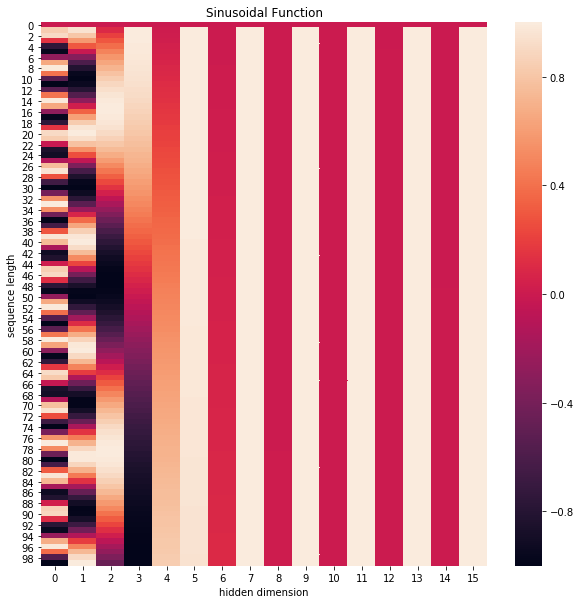
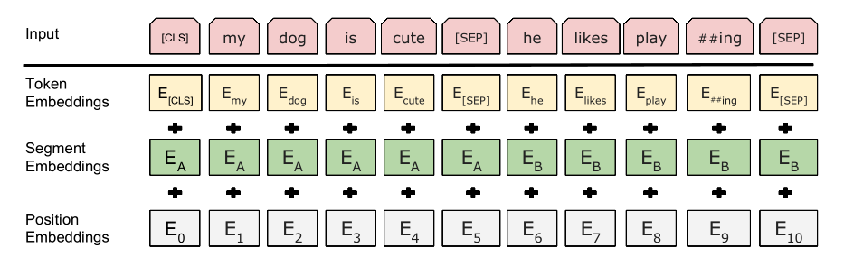

# Notes for BERT
首先我们要初始化字向量为$[vocab \ size, \ embedding \ dimension]$, $vocab \ size$为总共的字库数量, $embedding \ dimension$为字向量的维度, 也是每个词的向量表达.\
对于segment embedding 初始化为$[2,embedding\ dimension]$\
对于positional embedding 初始化为$[512,embedding\ dimension]$
# 1.Transformer
## 1.1 Positional Encoding
由于transformer模型没有循环神经网络的迭代操作, 所以我们必须提供每个字的位置信息给transformer, 才能识别出语言中的顺序关系.现在定义一个位置嵌入的概念, 也就是$positional \ encoding$, 位置嵌入的维度为
$$
[max \ sequence \ length, \ embedding \ dimension]
$$
嵌入的维度同词向量的维度, $max \ sequence \ length$属于超参数, 指的是限定的最大单个句长.对于较短的句子其在空白位置处填充0\
在这里论文中使用了$sine$和$cosine$函数的线性变换来提供给模型位置信息:
$$PE_{(pos,2i)} = sin(pos / 10000^{2i/d_{\text{model}}})\\
PE_{(pos,2i+1)} = cos(pos / 10000^{2i/d_{\text{model}}})\tag{eq.1}
$$
上式中$pos$指的是句中字的位置, 取值范围是$[0, \ max \ sequence \ length)$, $i$指的是词向量的维度, 取值范围是$[0, \ embedding \ dimension)$, 上面有$sin$和$cos$一组公式, 也就是对应着$embedding \ dimension$维度的一组奇数和偶数的序号的维度, 例如$0, 1$一组, $2, 3$一组, 分别用上面的$sin$和$cos$函数做处理, 从而**产生不同的周期性变化**, 而位置嵌入在$embedding \ dimension$维度上随着维度序号增大, 周期变化会越来越慢, 而产生一种包含位置信息的纹理, 就像论文原文中第六页讲的, 位置嵌入函数的周期从$2 \pi$到$10000 * 2 \pi$变化, 而每一个位置在$embedding \ dimension$维度上都会得到不同周期的$sin$和$cos$函数的取值组合, 从而**产生独一的纹理位置信息**, 模型从而学到位置之间的依赖关系和自然语言的时序特性.
下面画一下位置嵌入, 可见纵向观察, 随着$embedding \ dimension$增大, 位置嵌入函数呈现不同的周期变化.

## 1.2 Transofrmer Block
* Step 1:将输入的$X[batch\ size,max\ sequence \ length,embedding]$与位置编码相加(**Q:为什么相加不是相乘**)得到输入到Multi Head Attention中的输入$X_{embedding}$维度为:
$$
[batch\ size,max\ sequence \ length,embedding]
$$
* Step 2:将$X_{embedding}$分别进行线性映射
$$
Q = Linear(X_{embedding}) = X_{embedding}W_{query}\\
K = Linear(X_{embedding}) = X_{embedding}W_{keys}\\
V = Linear(X_{embedding}) = X_{embedding}W_{Value}\\
Q,K,L的维度均为[batch\ size,max\ sequence \ length,embedding]
$$
* Step 3 Multi-Head-Attention
设定超参数h为多注意力头数，将输入的Q,K,L的embedding均分为h份(注意对应整除关系)
$$
Q_{i}的维度：[batch\ size,max\ sequence \ length,embedding/h,h],为方便修改为：\\
[batch\ size,h,max\ sequence \ length,embedding/h]\\
K,V与Q相同
$$
以一个注意力头为例，首先计算K与Q的乘积，除以缩小因子，经过softmax得到对应每句话
$$
Attention(Q,K,V) = Softmax(\frac{QK^T}{\sqrt{embedding}})V \\
注意softmax是对相关性矩阵的第二个维度归一化，由于空白部分由0填补，在进行softmax时应使其变成负无穷以保证其不会影响到概率
$$
在经过Attention后输出维度为$[batch\ size,h,max\ sequence \ length,embedding/h]$,将h个结果拼接恢复为$[batch\ size,max\ sequence \ length,embedding]$
* Step 4 Layer Normalizition and Residual Connect
$$
Sublayer(X) = X + MultiAttention(X) \\
[batch\ size,max\ sequence \ length,embedding]
$$
对embedding统计均值$\mu=mean(Sublayer(X),dim=2)$,$\sigma^{2}=std(Sublayer(X),dim=2)$对Sublayer(X)做layer normalizition：
$$
NormLayer(X) = \alpha \frac{Sublayer(X) - \mu}{\sqrt{\sigma^{2}-\omega}}+ bias
$$
Step 5 Feed Forward
经过两层线性映射并激活，之后再经过类似的残差连接与normalizition,最终输出$
[batch\ size,max\ sequence \ length,embedding]$

# 2.BERT Architecture
## 2.1 Input/Output Representations
分词上使用WordPiece Embeddings方法,得到30,000个token词典，再加入[cls]和[sep]例如\
[cls] My dog is cute [sep] He likes staying with me [sep]\
[cls]表示作为句子的开头，其在经过transformer的计算后的hidden vector 可以用来表征整个句子的语义信息，作为分类任务的输入向量。[sep]是用来分开两个句子。最终的输入$E_{in}$由segment,position token embedding相加组成\

## 2.2 Pre-training BERT
### 2.2.1  Masked LM
双向模型比传统的单向(RNN)模型具有更好的表示文本语义的能力，虽然有bi-lstm等双向结构但问题是在训练时句子中的每个单词能“看到”其后面或者前面的单词，由此其更难具有良好的表征推断能力。\
在BERT中构建一个新任务 Masked Language Model,即将每次输入的token中随机用选择15%的token执行以下操作：
* 其中的80%用[Mask]替换,表示此处单词位置未知。
* 10%用token 词典里的随机一个token替代
* 10%不做改变

将mask后的的token输入到transformer中，得到隐藏值$T维度[max\ sequence\ length,hidden\ embedding]$将其映射到$[max\ sequence\ length,vocab\ size]$对vocab_size进行softmax得到对应token位置的预测，对之前mask的真实token与其预测的token做交叉熵损失，做训练优化。
### 2.2.2 Next Sentence Prediction
在问答，推理等任务中，模型需要具有理解上下句子联系的能力，传统的语言模型不具备这样的能力，由此提出NSP,输入由两个句子组成，这两个句子可能是相关的(IsNext,正样本)也有是不相关的(NotNext，负样本)，各取总50%，输入到模型中，最后将输出的[cls]对应的vector映射得到二分类的概率，二分类损失。
## 2.3 Pre-training data
使用BooksCorpus (800M words)与English Wikipedia (2,500M words)，对于wikipedia 只使用其文本段落，忽略表格等信息
# 3 Pre-training Procedure
## 3.1 DataLoader
* 从语料中采集两句话(50%的可能性为InNext,50%为NotNext),要求总输入长度不超过512
* 使用wordpiece embedding分词表示后，随机对15%的token进行mask处理
## 3.2 Training Strategy
* batch_size = 256
* max sequence length=512\
128,000 tokens/batch训练1,000,000 iteration,在 3.3 billion word corpus上约40个epoch
## 3.3 optimization settings
* Adam优化方法 lr=1e-4,$\beta_1=0.9$,$\beta_2=0.999$,
L2 weight decay of 0.01, learning rate warmup over the first 10,000 steps, and linear decay of the learning rate.
## 3.4 模型上的一些tricks
* 对所有layer使用dropout防止overfit
* 使用gelu 激活函数替代relu
## 3.5 其他细节
1.在4个TPU群(共16块TPU)训练BERT_base ,在64块TPU训练BERT_large,需要4天时间
2.为加快训练训练，在前90%的step中max sequence length=128,后10%的step 的max sequence length=512.在后10%的step中训练positional embeddings。

