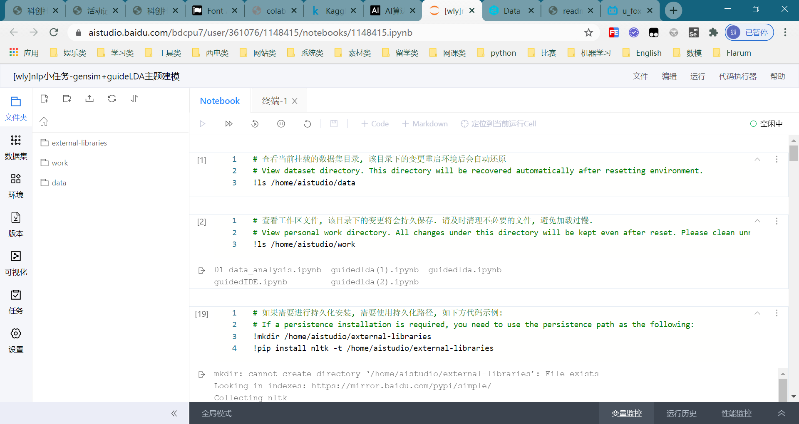
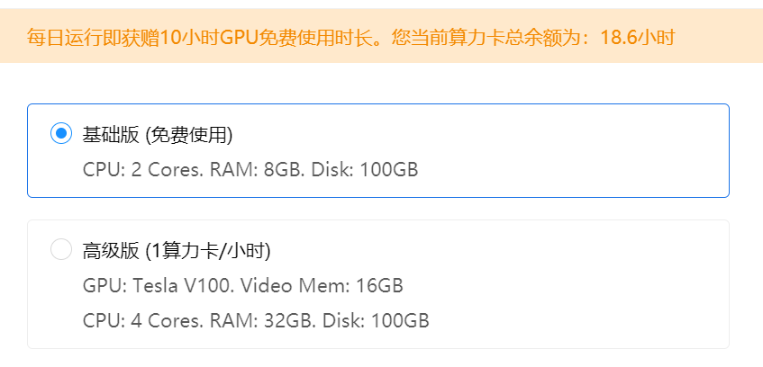
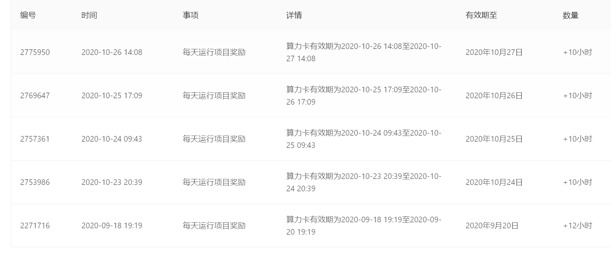
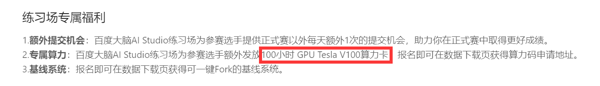
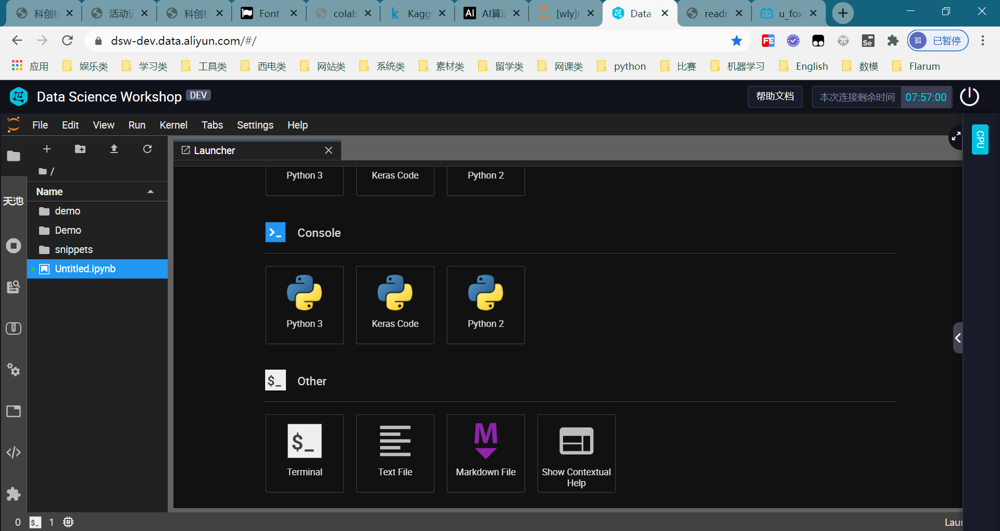
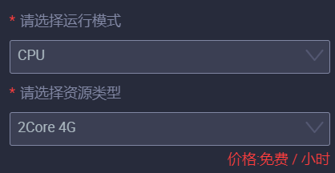
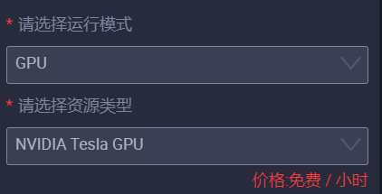
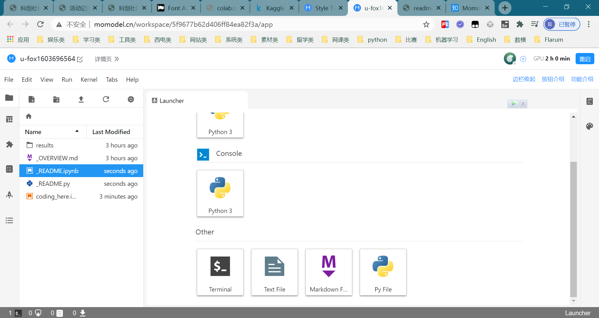

[TOC]

# 0 引言
> 白嫖是一门艺术。——老王学长
# 1 平台整理
## 1 国内
### 1.1 AI Studio
1) 官网：https://aistudio.baidu.com/aistudio/index  

2) 服务商：百度  
3) 配置：
- 基础版（无GPU）可以免费使用
- 高级版需消耗【算力卡】

4) 限制：高级版每周上最多使用70小时，不能使用pytorch和tenserflow

5) 【算力卡】规则：[官方文档](https://ai.baidu.com/ai-doc/AISTUDIO/nk39v9kec)
- 每日运行项目可获得10小时算力卡（有效期两天）

- 每拉取一个新用户助力即可获得10小时算力卡（有效期未知）
- 报名飞浆举办的比赛，**经工作人员电话确认** ，可以获得【专属算力】（一般为100小时，有效期30天）

### 1.2 DSW(Data Science Workshop)
1) 官网：https://dsw-dev.data.aliyun.com/#/  

2) 服务商：阿里云  
3) 配置：
- CPU

- GPU

4) 限制：使用时会创建一个【实例】，每个实例最多使用8小时
### 1.3 momodel
1) 官网：https://momodel.cn/  

2) 服务商：杭州芄兰科技有限公司
3) 配置：未知
4) 限制：GPU最多使用两小时

## 2 国外
### 2.1 gradient
1) 官网：https://gradient.paperspace.com/free-gpu
2) 服务商：Paperspace
3) 配置：
4) 限制：
### 2.2 colab
1) 官网：https://colab.research.google.com/notebooks/welcome.ipynb
2) 服务商：Google
3) 配置：
4) 限制：
### 2.3 kaggle
1) 官网：https://www.kaggle.com/
2) 服务商：Google
3) 配置：
4) 限制：

# 3 评测(SunNan)
### 3.1 评测方法
### 3.2 评测结果