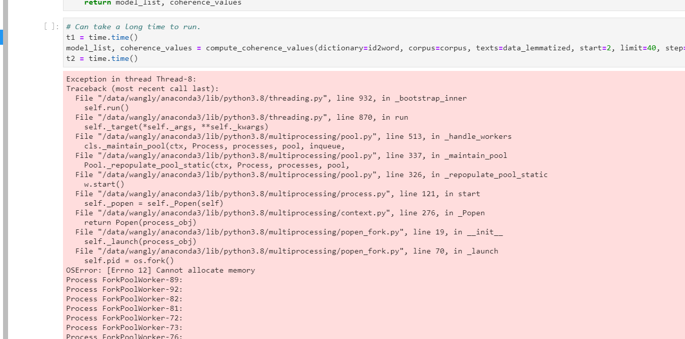
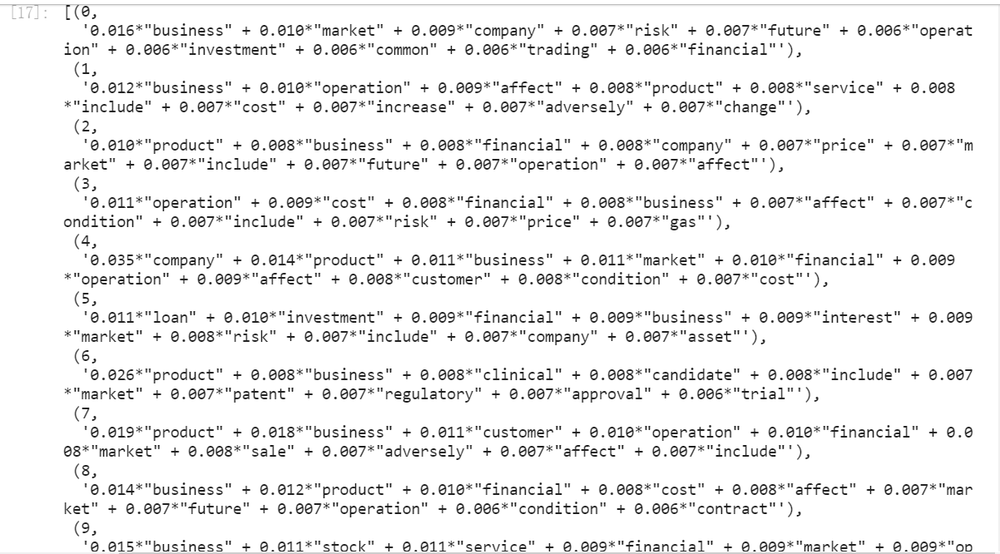
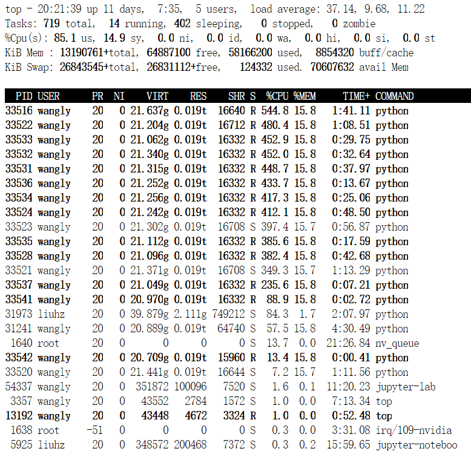
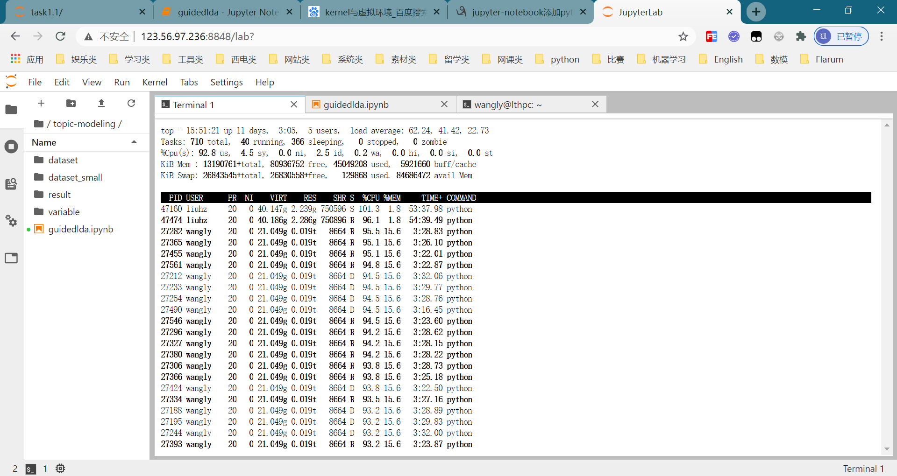

# Topic Modeling with Gensim
## 0 任务要求
- 通过Gensim进行主题建模
- 不一定用mallet model
- 一定要有一个Compare Model Perplexity and Coherence Score的过程
- 如果mallet模型更好，就用mallet
- 跑完step17确定要用几个topic
## 1 业务逻辑
1) 对初始数据进行分词 -> data_words
2) 去除停用词 -> data_words_nostops
3) 二元分词 -> data_words_bigrams
4) 词性还原（耗时） -> data_lemmatized
5) 核心代码：改变NUM_TOPICS的大小，建立多个LDA主题模型，找出最佳（coherence最大）主题数量
```python
# Create Dictionary
id2word = corpora.Dictionary(data_lemmatized)
# Create Corpus
texts = data_lemmatized
# Term Document Frequency(生成稀疏文档向量语料库)
corpus = [id2word.doc2bow(text) for text in texts]
```
```python
# 多核运算代码
import time
def compute_coherence_values(dictionary, corpus, texts, limit, start=2, step=3):
    coherence_values = []
    
    for NUM_TOPICS in range(start, limit, step):
        t1 = time.time()
        lda_model = gensim.models.ldamulticore.LdaMulticore(corpus=corpus,
                                                id2word=id2word,
                                                num_topics=NUM_TOPICS, 
                                                random_state=7,
                                                passes=10)
        lda_model.save(f'./result/model-{NUM_TOPICS}.gensim')
        t2 = time.time()
        
        # 计算一致性分数，Can also take a long time to run(多进程)
        coherencemodel = CoherenceModel(model=lda_model, texts=texts, dictionary=id2word, coherence='c_v')
        score = coherencemodel.get_coherence()
        t3 = time.time()

        # 结果打印
        result = f'{NUM_TOPICS}, 耗时：{(t2-t1)/60} + {(t3-t2)/60}, 得分：{score}\n'
        print(result)
        # 输出文件
        with open(f'./result/model-{NUM_TOPICS}.coherence', 'w') as f: f.write(str(score))
        with open(f'./result/log', 'a') as f: f.write(result)

        conherence_values.append(score)
        del lda_model, coherencemodel
    return coherence_values

# Can take a long time to run.
coherence_values = compute_coherence_values(dictionary=id2word, corpus=corpus, texts=data_lemmatized, start=10, limit=11, step=5)
```
输出样例
```python
>>> 5, 耗时：5.007284291585287 + 3.2269139488538108, 得分：0.3408829677367632
>>> 10, 耗时：6.009586253116234 + 4.9138532268109488, 得分：0.34689625964394855
>>> 15, 耗时：6.77867196003596 + 4.70052041610082, 得分：0.3423382559871098
>>> 20, 耗时：10.641985062758128 + 6.119113186995189, 得分：0.34514872057105517
...
```

## 2 改进
为了提高效率，我们将原始代码中调用`gensim.models.ldamodel.LdaModel`函数改为调用`gensim.models.ldamulticore.LdaMulticore`函数，即改为多进程操作，对单个主题建模速度明显提高。

当取NUM_TOPICS=5时：

|             | 数据集大小 | 耗时 |
| ----------- | ---------- | ----- |
| 单进程   | 500m       | 30min |
| 多进程(56h) | 2.8g       | <10min |


## 3 存在问题
### 3.1 model_list占用内存过高(>300g)
#### 描述
[Error 12] Cannot allocate memory  

#### 解决方案：
不使用model_list，改为每次保存lda_model到本地
### 3.2 部分单次在不同主题中均有分布且权值相近
#### 描述
例如，当NUM_TOPICS=10时的`business`和`financial`

#### 疑问
是否应当去除这些词后重新进行建模
### 3.3 LdaMulticore失效
#### 描述
对于循环：
```python
for NUM_TOPICS in range(start, limit, step)
```
第一轮时可以正常执行多进程，总耗时10min左右


第一轮完成后则始终是单进程，加载2小时也无法完成第二轮
#### 解决方案：尚未解决，目前是每次完成一轮后手动重启

## 4 目前结果（更新中）
| NUM_TOPICS | LDA建模耗时    | 计算一致性分数耗时 | Coherence           |
| ---------- | ------------------ | ------------------ | ------------------- |
| 5          | 5.007284291585287  | 3.2269139488538108 | 0.3408829677367632  |
| 10         | 6.009586253116234  | 4.5138532268109488 | 0.34689625964394855 |
| 15         | 6.77867196003596   | 4.70052041610082   | 0.3423382559871098  |
| 20         | 10.641985062758128 | 6.119113186995189  | 0.34514872057105517 |
| 25         | 15.165597438812256 | 6.831230827172598  | 0.3437547395516339  |
| 30         | 22.00732404390971 | 7.534529372056325  | 0.3437086947312853  |

可以看出：
- NUM_TOPICS越大，耗时越长
- coherence并非线性，会有波动